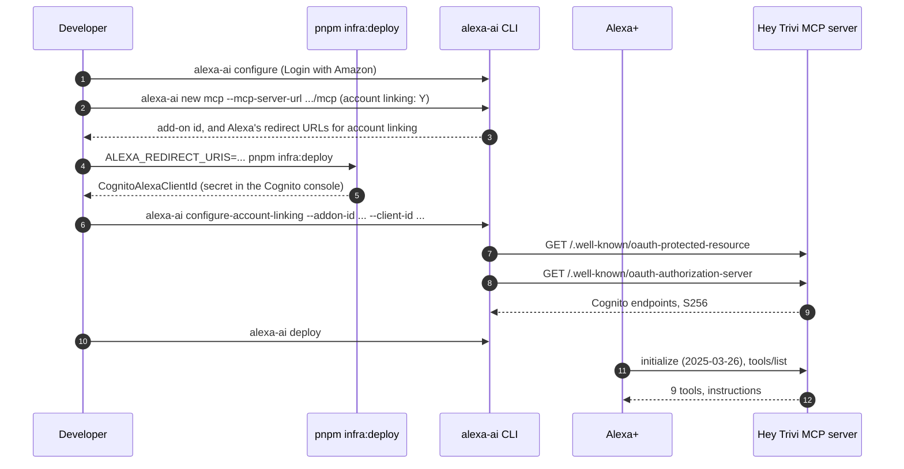
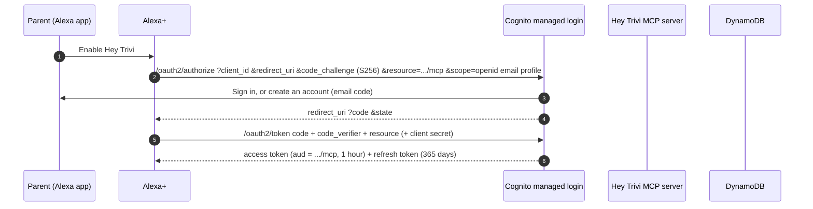
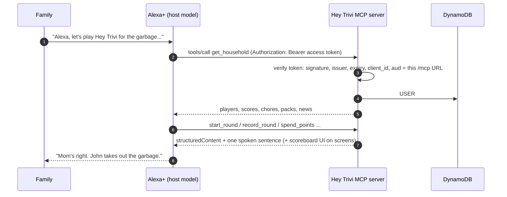

# Hey Trivi on Alexa+

How a family gets from "I want this on my Echo" to playing, what each piece of this repo does along the way, and how to register the add-on. None of this has run against real Alexa+ yet: hackathon entrants can't connect to it, and the MCP Toolkit is partner-only and US-only today. Everything below is written from Amazon's Alexa+ MCP Toolkit docs (checked October 9, 2026) and tested against stand-ins.

Sources: [Alexa+ MCP QuickStart](https://developer.amazon.com/docs/alexaplus/add-ons/mcp-toolkit-quickstart.html), [Account Linking for MCP Add-ons](https://developer.amazon.com/docs/alexaplus/add-ons/mcp-toolkit-account-linking.html), [MCP Client and App Lifecycle](https://developer.amazon.com/docs/alexaplus/add-ons/mcp-toolkit-client-lifecycle.html), [Cognito authorize endpoint](https://docs.aws.amazon.com/cognito/latest/developerguide/authorization-endpoint.html) (resource binding).

## The pieces

| Piece | Where | Role on Alexa+ |
|---|---|---|
| MCP server | Lambda function URL, `/mcp` | The add-on's endpoint. Alexa+ is the MCP client and the host model. |
| OAuth discovery | `/.well-known/oauth-protected-resource`, `/.well-known/oauth-authorization-server` on the same server | Alexa+ reads these at `configure-account-linking` and `deploy` to find Cognito. |
| Cognito user pool | `hey-trivi-parents`, managed login | The authorization server. One account per family, shared by Alexa+ and the parent page. |
| Cognito `alexa-plus` client | CDK, created when `ALEXA_VENDOR_ID` or `ALEXA_REDIRECT_URIS` is set | The OAuth client Alexa+ uses. Its callback URLs are Alexa's. |
| Parent page | Amplify, `/parent` | Same Cognito account. Names players, sets the phrase and resets, shows history. |
| Store listing | `alexa/addon-package/addon.json`, `/privacy`, `/terms`, `/alexa-assets/*.png` | What customers see in the Alexa app. |

## 1. Setup, once (developer)



Alexa+ reads the tools and the auth metadata only at deploy. Redeploy after changing either.

## 2. Linking, once per family (customer)



The parent can sign in with an account they already made on the parent page, or make one here. It's the same pool, so it's the same family either way.

## 3. Every conversation



When the access token expires, Alexa+ refreshes it on its own. If refreshing fails (token revoked, or the refresh token is over a year old), Alexa+ sends the parent through linking again.

### A family that starts by voice

A parent can link Hey Trivi in the Alexa app without ever opening the parent page. Their first call finds no household for their account. Answering 401 would send Alexa+ straight back into account linking, over and over. So the server creates the family on that first call instead, with the show name "Family Trivia Night" and the starter trivia and riddle packs (`householdForLinkedUser` in `services/mcp-server/src/auth.ts`). `get_household` then returns `needsPlayers: true` and tells the host to ask who's playing and call `add_player` for each person. The server's `instructions` say the same. The parent can rename the show, set the time zone (it starts as New York time), and turn on a parent phrase from the parent page later.

## What the server does for Alexa+

| Alexa+ requirement | How Hey Trivi meets it | Code |
|---|---|---|
| Streamable HTTP, spec 2025-11-25 | mcp-handler 2.x, stateless | `services/mcp-server/src/app.ts` |
| Alexa+ actually sends `initialize` with `2025-03-26` and a `roots` capability | Accepted and agreed; tested | `protocol.test.ts` "Alexa+ handshake" |
| 401 for missing or bad tokens, with no `WWW-Authenticate` header | `unauthorized()` | `services/mcp-server/src/auth.ts` |
| Protected resource metadata; `resource` matches the manifest URL exactly | `resource` is this server's `/mcp` URL, or `MCP_RESOURCE_URL` | `services/mcp-server/src/oauth.ts` |
| Auth server metadata with S256 | Points at Cognito's endpoints | `services/mcp-server/src/oauth.ts` |
| Authorization code + PKCE, `resource` parameter | Cognito supports both; `resource` sets the token's `aud` | Cognito |
| Static client registration (no DCR) | The `alexa-plus` Cognito client | `infra/lib/hey-trivi-stack.ts` |
| Refresh token with every access token | Cognito returns one; 365-day lifetime | `infra/lib/hey-trivi-stack.ts` |
| Bearer token in the header only | Query-string tokens are ignored; tested | `protocol.test.ts` |
| Under 500 ms round trip | p95 measured in `docs/latency-report.txt`; JWKS is cached per warm Lambda | `scripts/latency.ts` |
| Tool results: `structuredContent`, text, `_meta.ui.resourceUri` | Every tool; scoreboard tools reference `ui://hey-trivi/scoreboard` | `services/mcp-server/src/tools/` |

A token that Cognito bound to a different resource (`aud` isn't this server's `/mcp` URL) is refused. Parent page tokens carry no `aud` and are accepted.

## Register the add-on

1. Install the Alexa AI CLI (see Amazon's "Set Up Your Development Environment") and sign in:
   ```bash
   alexa-ai configure
   ```
2. Scaffold the add-on and say **Y** to account linking:
   ```bash
   alexa-ai new mcp --name "Hey Trivi" --locale en-US --mcp-server-url "https://<function-url>/mcp"
   ```
   Copy the store listing, media, and endpoint from `alexa/addon-package/addon.json` in this repo into the generated `addon-package/addon.json`. Keep anything the CLI generated that this file doesn't have, since the CLI's version is authoritative.
3. Create the Alexa client in Cognito with Alexa's redirect URLs. The CLI and the Alexa+ Developer Hub list them. Pass them all:
   ```bash
   ALEXA_REDIRECT_URIS="https://alexa.amazon.com/api/skill/link/<vendor-id>,https://pitangui.amazon.com/api/skill/link/<vendor-id>,..." pnpm infra:deploy
   ```
   Or set `ALEXA_VENDOR_ID=<vendor-id>` to use the usual four (`alexa.amazon.com`, `pitangui.amazon.com`, `layla.amazon.com`, `alexa.amazon.co.jp`). The deploy prints `CognitoAlexaClientId`. The client secret is in the Cognito console under App clients, then alexa-plus. `ALEXA_PUBLIC_CLIENT=1` makes a client with no secret, if Alexa+ turns out not to send one.
4. Give Alexa+ the client. The secret goes in the masked prompt:
   ```bash
   alexa-ai configure-account-linking --addon-id <addon-id> --stage development --client-id <CognitoAlexaClientId>
   ```
5. Deploy and test in the Alexa+ web simulator, then on a device:
   ```bash
   alexa-ai deploy
   ```
6. Before certification: set `CONTACT_EMAIL` on the Amplify app so the privacy policy names a real contact, and run `alexa-ai submit`.

The store images are drawn from the simulator's original speaker artwork at `/alexa-assets/icon-<size>.png`, `icon-dark-<size>.png`, `carousel.png` (600 x 900), and `banner.png` (1200 x 600). They contain no Amazon or Alexa artwork.

## Not verified, and what to check first

- **Redirect URLs.** Amazon's page shows only `alexa.amazon.com/api/skill/link/<id>` and says there are several by region. The other three come from classic Alexa skills. Use the CLI's list.
- **Client secret.** One part of Amazon's page calls it optional and another lists it as yours to provide. The sample token request sends only `client_id` in the body. If Alexa+ sends the secret with HTTP Basic, Cognito accepts that. If it sends no secret, redeploy with `ALEXA_PUBLIC_CLIENT=1`.
- **`resource` on refresh.** Alexa+ doesn't send `resource` when it refreshes. It's not documented whether Cognito keeps `aud` on refreshed tokens. Either way they're accepted: no `aud` passes, and the original `aud` matches.
- **The `accountLinking` key in `addon.json`.** Amazon says `alexa-ai new` sets `accountLinking.enabled: true`, but the published example doesn't show where. The CLI's generated file wins.
- **Invocation phrases.** The example phrases ("Let's play Hey Trivi") follow the add-on examples; Amazon doesn't document how Alexa+ routes to an add-on beyond "explicitly or implicitly".
- **Time zone.** Alexa+ sends no device time zone over MCP, so a family that starts by voice resets on New York midnight until a parent changes it.
- **The demo token.** `dev-token-demo` still opens the demo family on the deployed server (decisions #11). Before certification, stop seeding it (`SEED_DEMO` and `DEV_TOKEN` in `infra/lib/hey-trivi-stack.ts`) and delete the `TOKEN#dev-token-demo` item from the table.
